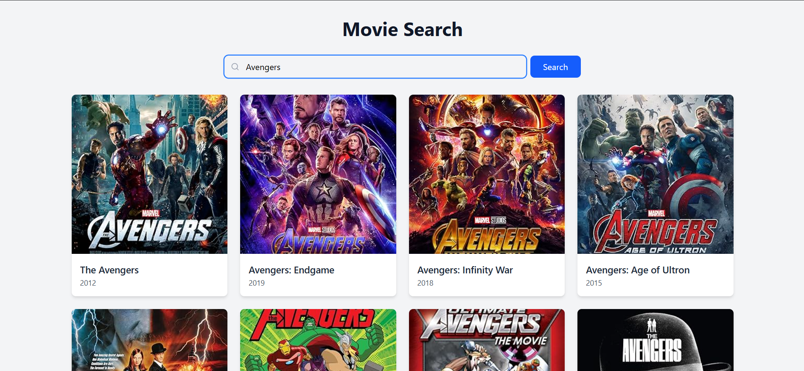

# Movie Search App
This is a React-based Movie Search App that fetches movie data from the OMDb API. Users can search for movies by title, view a list of results, and click on a movie to see more details.

 # [Live Link](https://bhupendra-maurya.github.io/Movie_Search/)

[](https://drive.google.com/file/d/1Bn09RBuj82-OiTcQIcLpKq1a261B8XyP/view?usp=sharing)


## Features

- **Search Bar**: Users can enter a movie title to search.
- **Fetch Results**: Retrieves movie data from the OMDb API.
- **Movie List**: Displays a grid of movies with posters, titles, and release years.
- **Movie Details**: Clicking on a movie displays additional details such as plot, actors, director, genre, and IMDb rating.

## Technologies Used

- React
- TypeScript
- Tailwind CSS
- OMDb API
- Lucide React Icons

## Installation

1. Clone the repository:
   ```bash
   git clone https://github.com/Bhupendra-Maurya/Movie_Search.git
   ```

2. Navigate to the project directory:
   ```bash
   cd movie-search
   ```

3. Install dependencies:
   ```bash
   npm install
   ```

4. Create a `.env` file in the root directory and add your OMDb API key:
   ```env
   VITE_OMDB_API_KEY=your_api_key_here
   ```

5. Start the development server:
   ```bash
   npm run dev
   ```

## Usage

1. Type a movie title in the search bar.
2. Click the "Search" button or press Enter.
3. Browse the movie results displayed in a grid.
4. Click on a movie card to view more details.
5. Click the close button (X) to return to the search results.


I deployed my assignment on Vercel, but it's blocking the OMDB API. I've pushed my code to GitHub and will upload a video there. I'll try to fix the issue, update the code, and push the changes along with the live link.  GitHub Link:- https://github.com/Bhupendra-Maurya/Movie_Search

Video Link:- https://drive.google.com/file/d/1Bn09RBuj82-OiTcQIcLpKq1a261B8XyP/view?usp=sharing